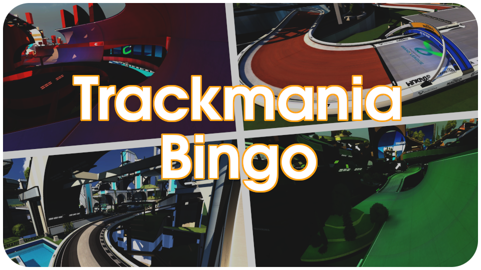

# 

> **[Trackmania Bingo](https://openplanet.dev/plugin/trackmaniabingo)** is a new gamemode where two or more teams compete be the first to complete a row, column or diagonal on the game board. Each cell on this board corresponds to a track that players can claim for their team by achieving a specific medal on that track.

This repository contains the source code for the game client, an Openplanet plugin written in [Angelscript](https://www.angelcode.com/angelscript/), as well as the backend, a web application and TCP game server written in [Rust](https://www.rust-lang.org/). Feel free to contribute to the development of this project by submitting an issue or pull request!

### License
Sources in this repository are using two different licenses. All the client source code under `client/` is licensed under the [GPL v3](client/LICENSE), while all code for the backend in `server/` is licensed under the [AGPL v3](server/LICENSE). See the respective licenses for more details.

### Community
Join us in our [Discord server](https://discord.gg/pJbeqptsEa) to get involved in the community!
